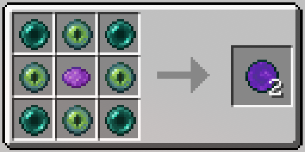
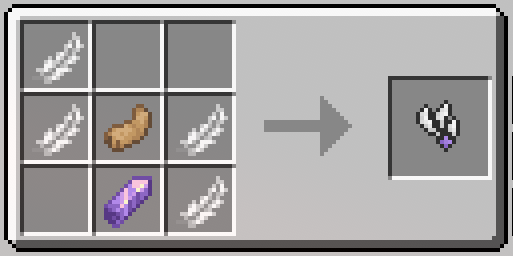
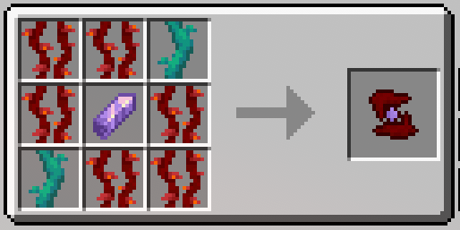
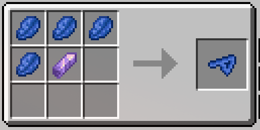
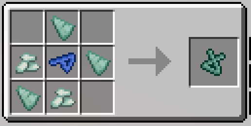
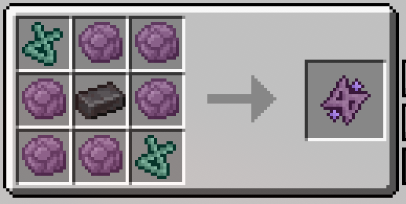

# Custom Portals Foxified

Custom Portals lets you build portals out of any block. Matching frames link together and allow easy distant travel. You can create networks of portals all across your world and dimensions. 

This mod is a NeoForge re-implementation of [Custom Portals](https://modrinth.com/mod/custom-portals) (Fabric).

<!-- TODO: screenshot/gif of portal in action -->

## Portals

Build a rectangular-ish frame using any solid block, then right-click the inside with a **Portal Catalyst**. Create a second frame out of the exact same block, light it with a matching catalyst color, and they link up instantly.

- Any block works as a frame; stone, leafs, diamond blocks, whatever you want
- Vertical or horizontal portals work, you can build frames on walls, floors, ceilings, even floating.
- 16 catalyst colors to organize your portal network
- Portals link by matching **color + frame material**
- Same-dimension and cross-dimension travel (with Gate Rune)
- Colored particles and portal effects just like vanilla portals
- Baaaahhh 🐑

<!-- TODO: gif showing portal creation + linking -->

### Catalysts

Shaped recipe: **4 ender pearls + 4 eyes of ender + 1 dye** -> 2 portal catalysts

Catalysts can also be recolored: any catalyst + a dye -> 1 catalyst of the new color (shapeless).

## Runes

Place rune blocks on the portal's frame to enhance it. The rune must be mounted on a block that is directly adjacent to a portal block.

| Rune | Effect | Key Ingredients |
|---|---|---|
| **Haste** | Instant teleportation (1 tick) | feathers, rabbit foot, amethyst shard |
| **Gate** | Enables cross-dimension linking | weeping vines, twisting vines, amethyst shard |
| **Enhancer** | Increases linking range to 1,000 blocks | lapis lazuli, amethyst shard |
| **Strong Enhancer** | Increases linking range to 10,000 blocks | prismarine, enhancer rune |
| **Infinity** | Unlimited linking range | popped chorus fruit, netherite ingot, strong enhancer rune |

Without runes, portals link within 100 blocks in the same dimension. Haste on either end of a linked pair grants instant teleportation for both sides.

Recipe Images

 

## Linking

Portals link automatically to the nearest compatible **unlinked** portal (same catalyst color + same frame block). If a portal is destroyed or disabled, its partner becomes unlinked and will search for a new valid match 🥀

This system is intentionally simple and deterministic. In multiplayer or dense same-color networks, relinking may choose a different frame than you expected. That is by design: placement/distance and layout matter, and it enables more creative portal topologies.

## Redstone

Redstone behavior is enabled by default: a redstone signal **turns off** a portal. While powered, the portal unlinks; when power is removed, it automatically re-links using the normal linking rules above.

Because this works per-portal, you can disable one end of a pair and let the freed portal find a different compatible partner if one exists. This supports builds like ABC portal switching, redstone-controlled travel networks, and multiplayer routing setups.

You can disable redstone interaction entirely in config if you prefer.

<!-- TODO: gif showing redstone toggle -->

## Configuration

Settings are split between two config files and can be edited in-game via the mod config screen (Mod Menu or the Mods button).

**Client** (`custom_portals_foxified-client.toml`):

| Setting | Default | Description |
|---|---|---|
| `muteSounds` | false | Mute portal ambient, trigger, and teleport sounds |

**Common** (`custom_portals_foxified-common.toml`) server-controlled:

| Setting | Default | Description |
|---|---|---|
| `maxPortalSize` | 64 | Maximum portal blocks a frame can enclose |
| `baseRange` | 100 | Linking range with no enhancer runes |
| `enhancedRange` | 1,000 | Linking range with weak enhancer rune |
| `strongRange` | 10,000 | Linking range with strong enhancer rune |
| `allowCrossDimension` | true | Whether Gate Runes can link across dimensions |
| `redstoneDisables` | true | Redstone signal turns off adjacent portals |

## Differences from the Original

### Why port?

The original mod works with Sinytra Connector, but connector can break mods and adds overhead. More importantly, the original mod uses mixins to rewrite Minecraft's teleportation sequence, which can cause crashes or data loss with mods that attach data to players. It's not the original dev's fault, it's just how modding goes.

This port uses NeoForge's native `Portal` interface instead. Vanilla handles all player data and dimension hopping. No mixins, no data loss, so hopefully better compatibility.

Beyond compatibility, this port also includes a number of improvements over the original:

Improvements over the original

>**Performance**
> - Removed per-tick block entity polling - the original mod ticks every portal block every game tick to check state. This port is fully event-driven (neighborChanged, link/unlink, rune changes)
> - No block entity at all - portal state lives in world saved data with spatial indexing
>
>**Compatibility**
> - No mixins - the original mod uses EntityMixin, ServerPlayerMixin, and LocalPlayerMixin to rewrite teleportation. This port uses NeoForge's native `Portal` interface so vanilla handles all entity data and dimension transitions cleanly
>
>**Gameplay**
> - Rune removal revalidates links - in the original, removing a gate rune from a cross-dimension pair leaves them linked. This port properly breaks incompatible links when runes are removed
>

### No Private Portals

The original mod's private portals feature is not included. The implementation didn't make practical sense in multiplayer. If you want to travel with a friend, what happens then? If there's real demand for portal access control, I can implement it; but a proper integration would be with something like FTB Teams.

### Redstone Modes

Compared to the original mod’s three redstone modes (`off`, `on`, `no effect`), this port uses one consistent behavior: powered portals are disabled (`redstoneDisables = true` by default).  
This keeps portal state predictable and supports practical routing builds; see [Redstone](#redstone) for full behavior details.

## Compatibility

- Requires NeoForge 1.21.1 (21.1.219+)

## Credits

Original [Custom Portals](https://modrinth.com/mod/custom-portals) mod by [Palyon](https://modrinth.com/user/Palyon-dev) (MIT licensed). This is a NeoForge reimplementation of their legendary work.

## License

GPL-3.0-or-later
